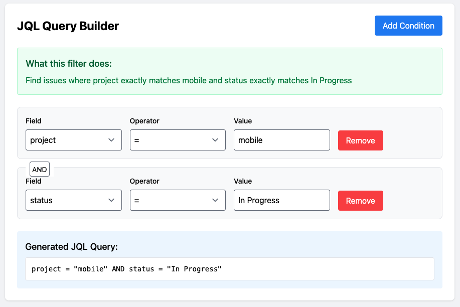

# JQL Query Builder

An intuitive, interactive tool for building and understanding JIRA Query Language (JQL) queries. This project transforms complex JQL syntax into human-readable explanations, making JIRA filtering accessible to both novice and experienced users.

## 🚀 Live Demo
Experience the tool in action: [JQL Query Builder](https://YOUR_USERNAME.github.io/jql-builder)

## 🎯 Key Features

- **Interactive Query Building**: Construct JQL queries through an intuitive interface
- **Real-time Plain English Explanations**: Understand exactly what your query will do
- **Multi-condition Support**: Build complex filters using AND/OR operators
- **Smart Field Handling**: Automatic formatting for different field types (dates, text, etc.)
- **Visual Feedback**: Clear indication of how conditions combine

## 🛠️ Technology Stack

- React 18
- Tailwind CSS
- Create React App
- GitHub Pages

## 🚦 Getting Started

### Prerequisites
- Node.js (LTS version recommended)
- npm or yarn
- Git

### Local Development
```bash
# Clone the repository
git clone https://github.com/PowerUpSkills/jql-builder.git

# Navigate to project directory
cd jql-builder

# Install dependencies
npm install

# Start development server
npm start
```

### Building for Production
```bash
# Create optimized production build
npm run build

# Deploy to GitHub Pages
npm run deploy
```

## 🎨 Usage Examples

1. **Simple Project Filter**
   ```sql
   project = "MOBILE" AND status = "In Progress"
   ```
   Finds all in-progress issues in the MOBILE project


*The interface provides immediate feedback on your query construction, helping you understand exactly what your filter will do.*

2. **Complex Multi-condition Query**
   ```sql
   project IN ("WEB", "API") AND status != "Done" AND priority >= "High"
   ```
   Locates high-priority, incomplete issues across web and API projects

## 🔧 Customization

### Adding New Fields
Extend `constants.js` to include additional JIRA fields:
```javascript
export const FIELDS = [
  'project',
  'issuetype',
  // Add your custom fields here
];
```

### Modifying Operators
Customize available operators in `constants.js`:
```javascript
export const OPERATORS = [
  '=', '!=', 'IN',
  // Add custom operators
];
```

## 💡 Implementation Notes

The JQL Builder is designed with real-world JIRA workflows in mind. Key implementation features include:

- **Intelligent Field Recognition**: Automatically formats values based on field type
- **Context-Aware Operators**: Shows only relevant operators for each field
- **Real-time Validation**: Prevents common JQL syntax errors
- **Responsive Design**: Works seamlessly across desktop and tablet devices

## 🤝 Contributing

We welcome contributions! Here's how you can help:

1. Fork the repository
2. Create a feature branch (`git checkout -b feature/AmazingFeature`)
3. Commit changes (`git commit -m 'Add AmazingFeature'`)
4. Push to branch (`git push origin feature/AmazingFeature`)
5. Open a Pull Request

## 📝 License

This project is licensed under the MIT License - see the [LICENSE](LICENSE) file for details.

## 🙏 Acknowledgments

- Inspired by JIRA's advanced search capabilities
- Built with React and Tailwind CSS communities' best practices
- Special thanks to all contributors and users providing feedback

## 📞 Support

- Create an issue for bug reports or feature requests
- Star the repository if you find it useful
- Fork it to contribute or create your own version

---

Built with ❤️ by JayDee
